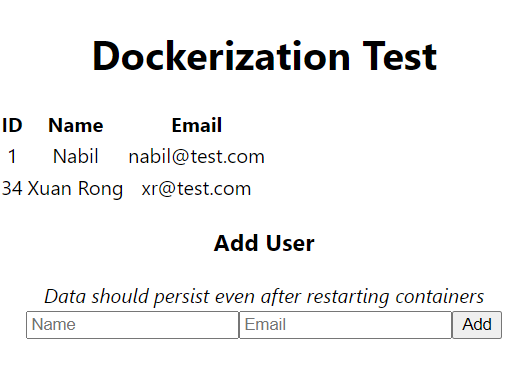

# Dockerizing-Demo

In this demo, I use docker to dockerize React, Express and PostgreSQL.



## What have I learnt?

From GeekOut 2022, I stumbled upon the idea of Docker and containers. I watched videos on the subject (on PluralSight - Thanks Project INC) and I started to learn how to use it. I fell in love with the idea of dockerizing applications because it is a great way to share code and resources and no more excuses of "it works on my machine!".

## What this demo has?

This demo shows the dockerization of React, Express and PostgreSQL applications. I managed to persist data in PostgreSQL (in the `./database` folder)

## Important Ports

-   `3000`: React App
-   `3001`: Express App
    -   Endpoints:
        -   GET `/test`: Get all users
        -   POST `/test`: Create a new user
-   `5430`: PostgreSQL

## Development

Since Docker is the "Production" build, any development is done by using your standard commands. The only difference is that you need to use the `docker compose` command to **ONLY** start the database.

To start the database, run the following command:

```
docker compose up -d --build --no-deps postgresql
```
